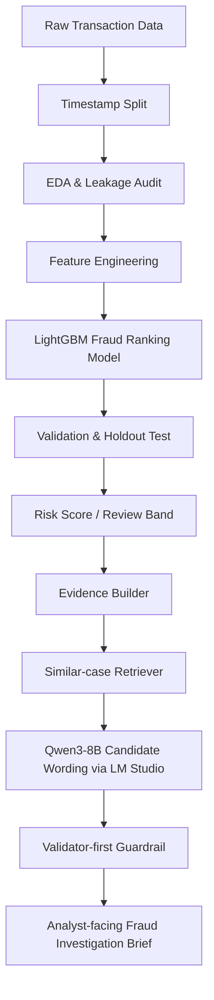
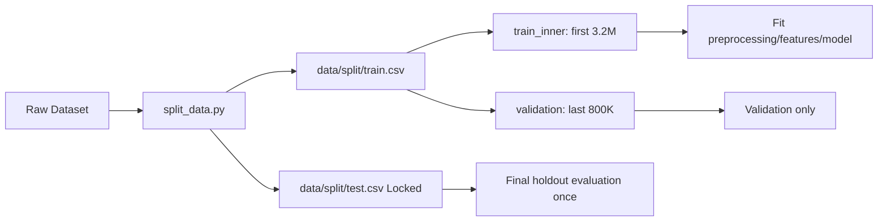
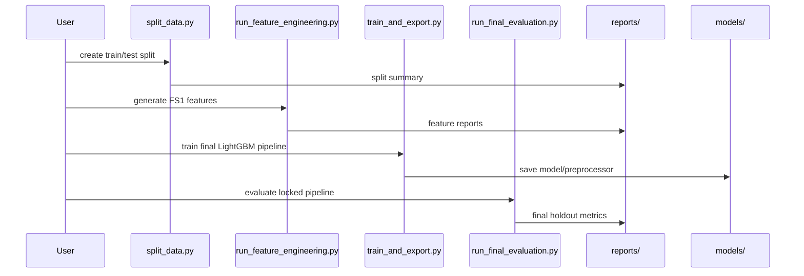
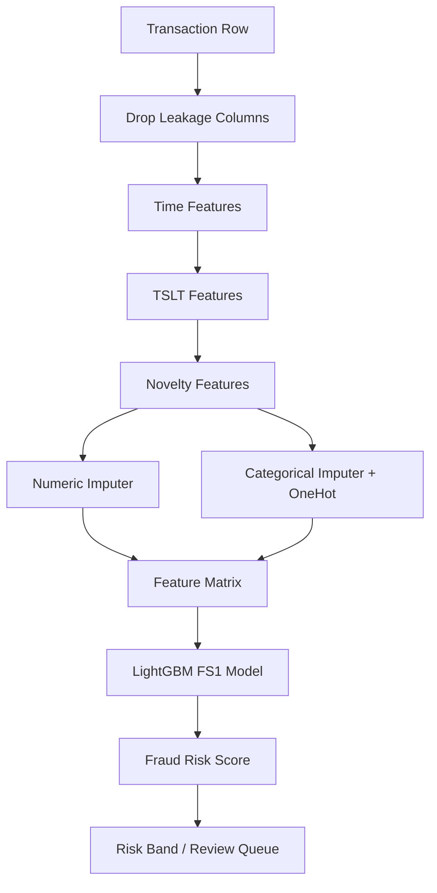
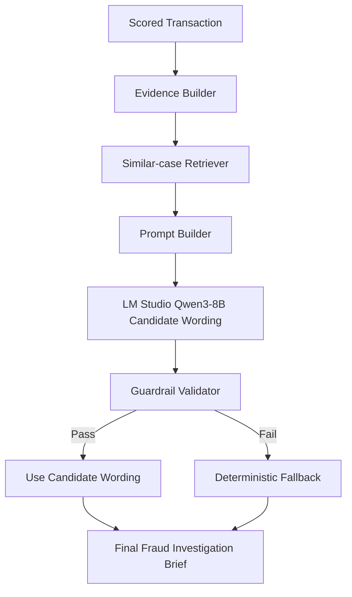

# TEAM_ONBOARDING_VISUAL_GUIDE

## 1. Purpose of This Guide
* File này là onboarding guide dành cho teammate mới gia nhập dự án.
* Để tham chiếu kỹ thuật chi tiết hơn, vui lòng đọc `CODEBASE_EXPLAINED.md`.
* File này là visual walkthrough nhằm giúp bạn nắm bắt hệ thống nhanh chóng chỉ trong 15-30 phút.
* Dự án này là một hệ thống **fraud-ranking baseline** kết hợp với phần mở rộng **LLM Fraud Review Co-pilot**.
* Lưu ý quan trọng: Toàn bộ hệ thống không phải là autonomous fraud detector (không tự động đưa ra quyết định hay chặn giao dịch).

## 2. System in One Picture



**Mô tả ngắn gọn:** 
Dữ liệu thô đi qua quá trình làm sạch, chia tách, kiểm soát leakage và tính toán feature để đưa vào mô hình LightGBM chấm điểm rủi ro. Các giao dịch có điểm cao sẽ được LLM Co-pilot tổng hợp chứng cứ và so sánh với lịch sử lân cận, sau đó đi qua hệ thống kiểm duyệt (guardrail) trước khi xuất thành báo cáo (brief) hỗ trợ con người đánh giá cuối cùng.

## 3. 15-Minute Teammate Reading Path
Hãy đọc các tài liệu sau theo thứ tự để nắm bắt trọn vẹn bối cảnh dự án:

* [x] `README.md`
* [x] `docs/TEAM_ONBOARDING_VISUAL_GUIDE.md` (File bạn đang đọc)
* [ ] `docs/CODEBASE_EXPLAINED.md`
* [ ] `reports/final_project_report.md`
* [ ] `reports/lmstudio_qwen3_copilot_samples_final_deterministic.md`

## 4. Repository Mental Model

```text
data/       -> input data
src/        -> ML pipeline code
models/     -> exported model/retriever/preprocessor
reports/    -> experiment outputs and final reports
docs/       -> human-facing documentation
notebooks/  -> exploratory research logs
configs/    -> configuration files
tests/      -> unit tests scripts
```

| Folder | What it contains | Who should care |
| ------ | ---------------- | --------------- |
| `data/` | Dữ liệu raw và đã split (`train.csv`, `test.csv`) | Data Engineers, ML Engineers |
| `src/` | Chứa mã nguồn toàn bộ pipeline (FE, Train, Eval, Retriever) | ML Engineers, Developers |
| `models/`| Các file `.pkl` của LightGBM, Preprocessor, RAG retriever | Mọi người (dùng cho deployment/inference) |
| `reports/`| Output markdown report của từng bước thực nghiệm | Data Scientists, Product Managers |
| `docs/` | Tài liệu hệ thống và hướng dẫn onboarding | Toàn bộ thành viên đội dự án |
| `notebooks/`| Các notebook nghiên cứu thô ban đầu (Baseline, Exploratory) | Data Scientists (chỉ để xem lại lịch sử) |

## 5. Data Lifecycle Diagram



**Lưu ý:**
* Test set tuyệt đối không được dùng để tune hyperparameters hoặc làm lại feature.
* Validation set dùng để lựa chọn pipeline (VD: chọn LightGBM FS1, thử nghiệm Cascade B).
* Test (Final holdout) chỉ được mở một lần duy nhất sau khi đã chốt cứng pipeline hoàn chỉnh.

## 6. ML Pipeline Sequence



## 7. Script-to-Artifact Map

| Script / Module | Reads | Writes | Purpose | Safe to rerun? |
| --------------- | ----- | ------ | ------- | -------------- |
| `split_data.py` | Raw data | `train.csv`, `test.csv` | Chia data theo thời gian | Yes (nếu cần reset) |
| `src/run_eda_deep_dive.py` | `train.csv` | `reports/eda_train_deep_dive_report.md` | Phân tích phân phối, artifact | Yes |
| `src/run_feature_engineering.py`| `train.csv` | `reports/feature_engineering_report.md` | Xây dựng base & novelty feature | Yes |
| `src/run_baseline_modeling.py` | `train.csv` | `reports/baseline_modeling_report.md` | Thử nghiệm thuật toán baseline | Yes |
| `src/train_and_export.py`| `train.csv` | Các file `.pkl` trong `models/` | Huấn luyện final model và lưu lại | Yes |
| `src/run_final_evaluation.py` | `test.csv`, `models/*.pkl` | `reports/final_test_evaluation_report.md`| Đánh giá holdout | Yes (nhưng không dùng kết quả để sửa model) |
| `src/run_graph_audit.py` | `train.csv` | `reports/graph_feasibility_audit_report.md` | Thử nghiệm graph feature | Yes |
| `src/run_cascade_experiment.py` | `train.csv` | `reports/segmented_cascade_experiment_report.md`| Thử nghiệm mô hình V2 Cascade B | Yes |
| `run_lmstudio_copilot_demo.py` | `test.csv`, `models/*.pkl`| `reports/lmstudio_qwen3_copilot_samples_...md`| Sinh báo cáo bằng LLM và RAG | Yes (cần mở LM Studio) |
| `src/llm_client.py` | LM Studio Endpoint | Output string | Gọi model Qwen3 và kiểm duyệt kết quả | Yes |

## 8. Final Model Flow



**Mô tả:** Final feature set (FS1) là tập hợp của Baseline features (Thời gian, Số lượng, TSLT) và Novelty binary features (Location mới, Device mới).

## 9. LLM Co-pilot Flow



**Mô tả:** 
* LLM (Qwen3) chỉ đảm nhiệm việc tạo candidate wording để giải thích rủi ro.
* Lớp Guardrail mới là chốt chặn quyết định thông tin nào được đưa vào report.
* LLM không tự đưa ra quyết định fraud.
* Các "similar cases" lấy từ retriever chỉ là dữ liệu hàng xóm cho thêm ngữ cảnh, không phải nguyên nhân kết tội (causal proof).

## 10. Where to Change What

| Goal | File to edit | Notes |
| ---- | ------------ | ----- |
| Sửa feature engineering | `src/run_feature_engineering.py` | Tác động trực tiếp lên chất lượng input matrix |
| Sửa preprocessing | `src/preprocessing.py` | Logic fillna, OneHotEncoder cho categorical |
| Sửa final model config | `src/train_and_export.py` & `src/run_baseline_modeling.py` | Thông số hyperparams của LightGBM |
| Sửa evaluation metrics | `src/run_final_evaluation.py` | Thay đổi cách in biểu đồ, tính Recall@K, Precision@K |
| Sửa LLM prompt | `src/llm_client.py` | Đổi system instruction cho Qwen3-8B |
| Sửa banned phrases | `src/llm_client.py` | Thêm bớt từ khóa cấm ở hàm `validate_guardrails` |
| Sửa deterministic fallback text | `src/llm_client.py` | Đổi template an toàn được hardcode theo Risk Band |
| Sửa demo sample selection | `run_lmstudio_copilot_demo.py` | Sửa logic lấy mẫu giao dịch (Low/Medium/Review/High) |
| Sửa report output path | Script gọi report tương ứng | Tìm biến `REPORT_PATH` ở đầu mỗi file `.py` |

## 11. Do Not Touch / Do Not Do Checklist

```text
[ ] Do not use fraud_type as feature.
[ ] Do not use transaction_id as feature.
[ ] Do not use raw sender_account / receiver_account / ip_address / device_hash directly.
[ ] Do not use target encoding in final model.
[ ] Do not use label-history features in final model.
[ ] Do not use SMOTE in the main pipeline.
[ ] Do not tune on the test set.
[ ] Do not rerun final test and then change the model based on that result.
[ ] Do not let LLM make fraud decisions.
[ ] Do not recommend automatic blocking, fund freezing, or account suspension.
```

## 12. Decision Log

| Decision | Tried / Considered | Result | Final Decision |
| -------- | ------------------ | ------ | -------------- |
| Baseline Algorithm | Random Forest vs LightGBM | LightGBM chạy nhẹ, nhanh hơn và dễ chỉnh params | Final FS1 + LightGBM |
| Xử lý mất cân bằng | SMOTE | Gây nhiễu phân phối thật tế, over-optimistic | Reject SMOTE |
| Label-history | Dùng nhãn quá khứ của sender | Nguy cơ data leakage ở production | Reject target-history final |
| Graph Modeling | Deep Graph / Node2Vec | Dữ liệu lặp lại yếu, signal thu về gần như random | Reject graph deep modeling |
| Cascade Approach | Split data theo feature pattern | PR-AUC tăng nhẹ nhưng không đủ đáng kể để đổi mô hình | Keep Cascade B as V2 candidate |
| LLM Co-pilot Trust | LLM viết text tuỳ do | Rủi ro bịa đặt nguyên nhân hoặc đề xuất phi logic | Use validator-first LLM co-pilot |
| TSLT missing = 1 | Drop feature hoặc lấp null | Feature quan trọng nhưng lệ thuộc lớn (có thể là data artifact) | Treat TSLT-missing as artifact risk |

## 13. Common Troubleshooting

| Problem | Likely Cause | Fix |
| ------- | ------------ | --- |
| `ModuleNotFoundError` | Quên cài đặt thư viện | Chạy `pip install -r requirements.txt` |
| `LightGBM not installed` | Missing compiler (Windows/Mac) hoặc package chưa đúng | Cài bản build binary phù hợp hoặc dùng lệnh conda/pip riêng |
| `FileNotFoundError` | Chưa chia dữ liệu ban đầu hoặc sai đường dẫn | Chạy `python split_data.py` hoặc check lại path relative từ root repo |
| LM Studio `connection refused` | Local server chưa mở hoặc sai port | Mở LM Studio, bật server trên tab Local Server, kiểm tra port 1234 |
| LM Studio model name not found | Model ID bị sai | Mở `src/llm_client.py` cập nhật tên `qwen/qwen3-8b:2` cho đúng với file đang load |
| Memory issue when loading CSV | Dữ liệu `train.csv` lớn (4M rows) | Tắt các ứng dụng không cần thiết hoặc đổi type object sang phân mảnh (chunk) |
| OneHotEncoder version mismatch | Khác phiên bản scikit-learn lúc train và eval | Cài đúng phiên bản của thư viện, xem file requirements |
| No output report generated | Lỗi code bị văng (Exception) ở giữa | Đọc kỹ traceback trong terminal và kiểm tra log |

## 14. How to Demo to a Teammate
Kịch bản 5 phút để onboarding người mới:
1. **Show final test metrics:** Mở `reports/final_test_evaluation_report.md` cho họ thấy PR-AUC và các Recall@K.
2. **Explain weak ranking baseline:** Chỉ ra rằng signal khá yếu nhưng vẫn nhỉnh hơn mức ngẫu nhiên.
3. **Show top-K business interpretation:** Đưa ra ví dụ về số case fraud sẽ bắt thêm nếu đội operation review Top 1%.
4. **Show LLM co-pilot sample report:** Mở file demo `reports/lmstudio_qwen3_copilot_samples_final_deterministic.md`.
5. **Explain guardrails and fallback:** Cho họ thấy LLM bị giới hạn bởi deterministic layer (nếu nói bậy sẽ bị thay bằng text an toàn).
6. **State limitations honestly:** Chỉ ra các điểm yếu của dự án (TSLT artifact, thiếu real analyst notes).

## 15. Expected Outputs

| Run command | Expected output |
| ----------- | --------------- |
| `python split_data.py` | Files `data/split/train.csv` và `data/split/test.csv` |
| `python src/run_baseline_modeling.py` | Báo cáo `reports/baseline_modeling_report.md` |
| `python src/train_and_export.py` | Các object `models/calibrated_lgbm.pkl`, `models/preprocessor.pkl`, `models/retriever.pkl`,... |
| `python src/run_final_evaluation.py` | Báo cáo `reports/final_test_evaluation_report.md` |
| `python run_lmstudio_copilot_demo.py` | Báo cáo `reports/lmstudio_qwen3_copilot_samples_final_deterministic.md` |

## 16. Final Mental Model
* **ML model** chịu trách nhiệm chấm điểm và xếp hạng giao dịch (ranks transactions).
* **Analyst** là người nhận các giao dịch có độ ưu tiên cao để review.
* **Retriever** cung cấp các sample tương đồng về mặt structured feature cho bối cảnh.
* **LLM** có nhiệm vụ tạo nháp candidate wording dựa trên feature.
* **Guardrail layer** sẽ kiểm soát từ khóa và là chốt chặn cuối quyết định nội dung ra mắt Analyst.
* **Con người (Human)** luôn là bên duy nhất chịu trách nhiệm ra quyết định cuối cùng!
